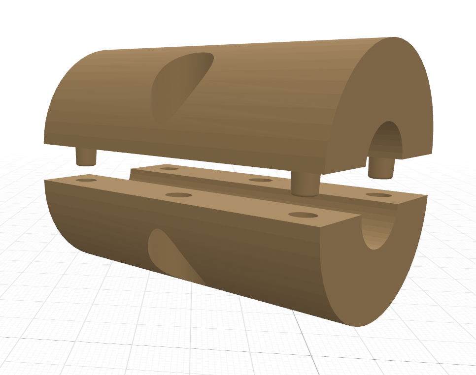
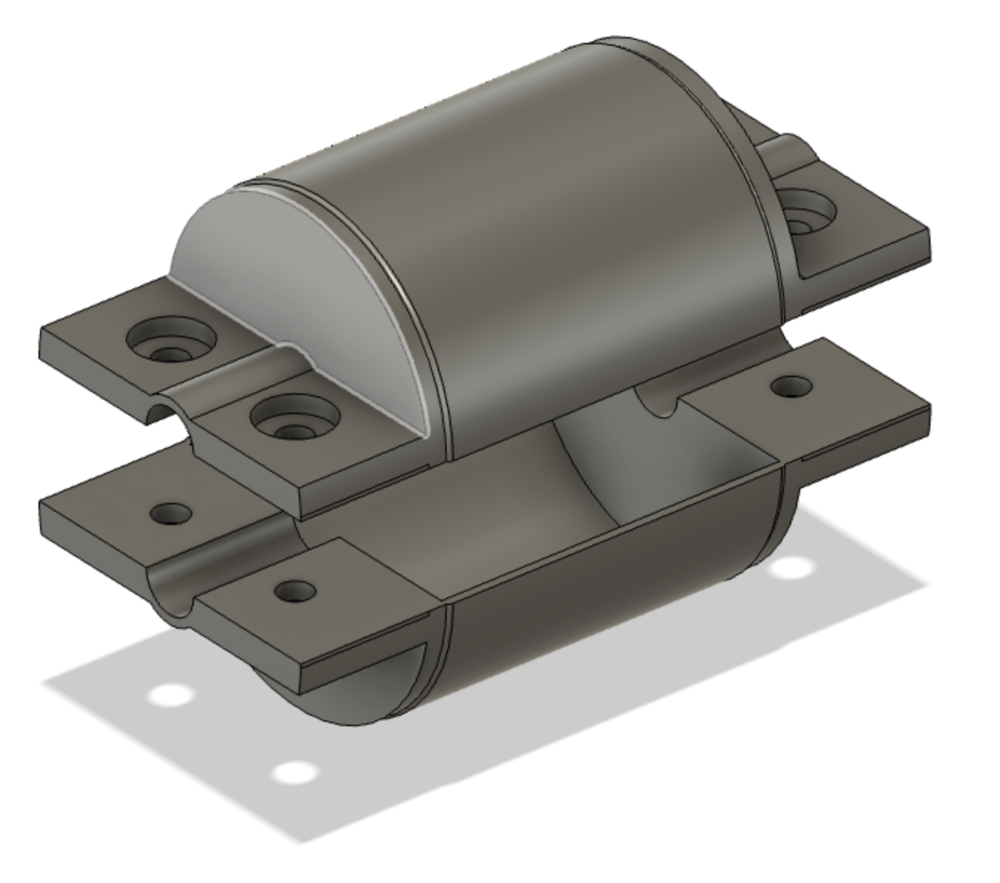
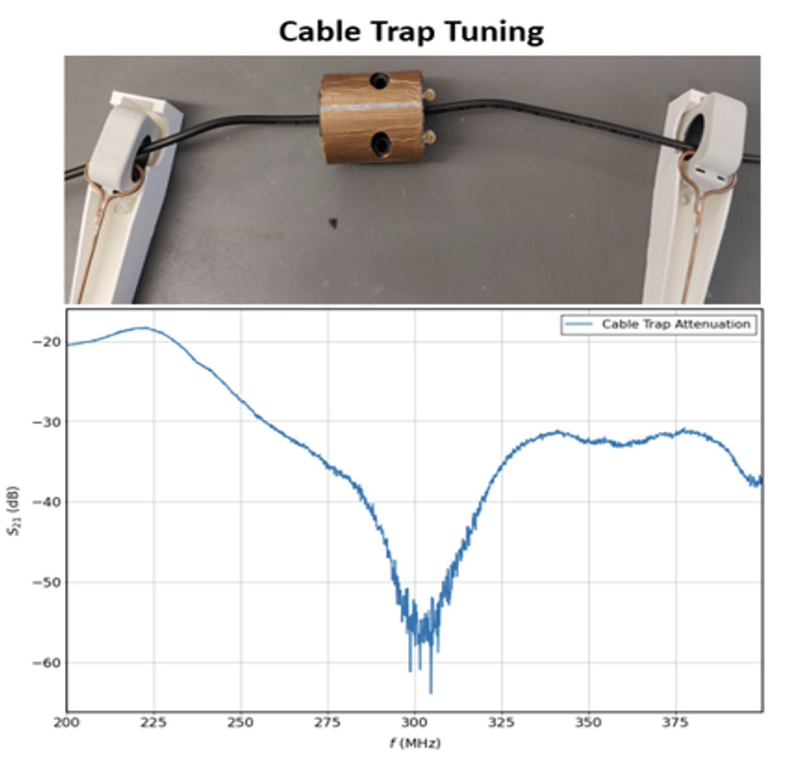

# floating-cable-trap
Floating Cable Trap Design

This repository contains source and output files for a 3D printed floating cable trap for use with MRI coils.

Cable traps are used to suppress common-mode currents in the shields of coaxial cables.

## Components

**1. Cable Trap**

The cable trap contains two half-cylinders that act as a cylindrical capacitor. The capacitance (F/m) and inductance (H/m) of the cable trap can be computed using the equations:

$$ L = \frac{\mu}{2\pi} \ln{\frac{b}{a}} $$
$$ C = \frac{2\pi\varepsilon}{\ln{b/a}} $$

where $a$ is the inner diameter and $b$ is the outer diameter. $\varepsilon$ is the absolute permittivity of the dielectric material - ABS filament typically has $\varepsilon = 2.86$. 

Use copper tape to cover the top and bottom half circles. Do not put copper tape on the flat surfaces and do not connect the two sides together with tape.

The files in the `Trap_Cylinder/` folder has the design in two formats, in OpenSCAD (size customizable) and as a SOLIDWORKS file. There are also .stl examples that you can 3D print.

Connect the two cylindrical halves together using a nylon nut and bolt. Metallic bolts may work for non-MRI applications, making sure the bolts are not shorting the copper tape.

**2. End PCB**

The end PCBs are for the ends of the half-cylinder. Each half of the copper tape is attached (possibly by  solder) to each half of the PCB. A **tuning** capacitor connects the two traces.

The files in `End_Board/` contains KiCAD 6 files for the board, but this can also be implemented using copper tape or scrap PCB.

**3. Cable Trap Cover**

The optional cable trap cover provides protection and additional support to the cable traps. The files in `Trap_Cover/` can be opened in Fusion360.

## Tuning the Cable Trap

The cable trap can be tuned by placing a (50$\omega$) terminated coaxial cable, then measuring the current on both sides of the cable using an RF current probe connected to a network analyzer (S21). Adjust the **tuning** capacitor on the End PCB so that the minimum S21 is at the intended frequency.  

## Contributors

Angel G Enriquez
Jana M Vincent
Folk W Narongrit
Thejas Vishnu Ramesh
Joseph V Rispoli